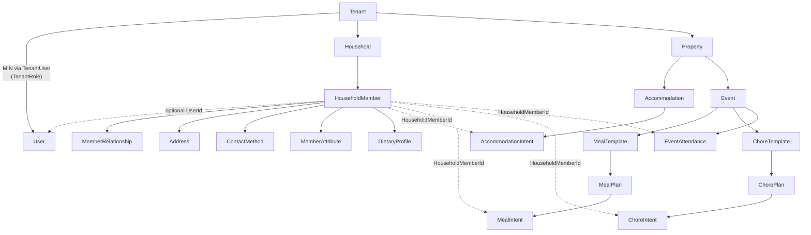
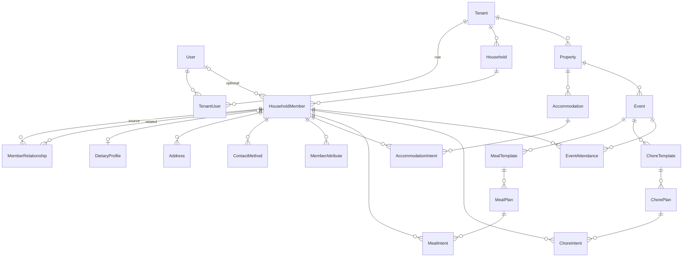

# Gatherstead Architecture

## Technology Stack
This repository uses an Azure-first architecture with a C# .NET API and a Vue 3 / Nuxt 3 web UI. Keep changes aligned with these directions.

## Domain-Driven Design Overview
Gatherstead is organized around bounded contexts that align with the two core goals while sharing a multi-tenant foundation.

### Shared Foundation (Tenancy)
- **User**: Authenticated identity (Entra ID login) with an `ExternalId` for the Entra subject and an `IsAppAdmin` flag for platform-level administrative access. App Admins bypass all tenant and resource authorization checks and are the only role permitted to create tenants.【F:src/Gatherstead.Data/Entities/User.cs】
- **Tenant**: Top-level aggregate for an extended family or organization. Tenants own households, properties, events, and users, providing isolation across families or groups. Tenant creation requires App Admin privilege and specifies the initial Owner user.【F:src/Gatherstead.Data/Entities/Tenant.cs】

### Family Directory Context
- **Household**: Represents a family grouping under a tenant and owns its members.【F:src/Gatherstead.Data/Entities/Household.cs】 Households can evolve as families split or merge.
- **HouseholdMember**: Person-centric record that stores name, birth date, dietary notes/tags, and adult/child markers, with Always Encrypted columns for sensitive data.【F:src/Gatherstead.Data/Entities/HouseholdMember.cs】 This is the anchor for relationships to gatherings, meals, and lodging intents. Members may optionally be linked to a **User** (Entra login) via a nullable `UserId` foreign key, enabling "Self" edit permissions. Each member also carries a **HouseholdRole** (`Admin` or `Member`) to control household-level management authority.
- **MemberRelationship**: Parent/child/sibling/spouse/guardian links modeled as member-to-member relationships with type and notes. Relationships can span households within the same tenant, keeping lineage flexible for split-family scenarios. Relationship types are informational; edit permissions are derived from `HouseholdRole` and `UserId` linkage, not from relationship entries.【F:src/Gatherstead.Data/Entities/MemberRelationship.cs】
- **Address**: Mailing addresses attached to a member with a primary-address designation (at most one primary per member, enforced by a filtered unique index).【F:src/Gatherstead.Data/Entities/Address.cs】
- **ContactMethod**: Email, phone, or other contact entries per member, with primary-contact designation mirroring the address pattern.【F:src/Gatherstead.Data/Entities/ContactMethod.cs】
- **MemberAttribute**: Extensible key-value pairs on a member for custom metadata (e.g., t-shirt size, accessibility needs), with a unique constraint on key per member.【F:src/Gatherstead.Data/Entities/MemberAttribute.cs】
- **DietaryProfile**: Comprehensive dietary record per member (one-to-one) capturing preferred diet, allergies, restrictions, and notes. A tenant-level list endpoint supports aggregation across attending members for meal planning.【F:src/Gatherstead.Data/Entities/DietaryProfile.cs】

### Gathering Planning Context
- **Property**: Physical location that can host events and belongs to a tenant.【F:src/Gatherstead.Data/Entities/Property.cs】
- **Accommodation**: A place a member may occupy at a property (e.g., guest room, bunk, RV pad, tent site, or offsite placeholder). Accommodations are owned by a `Property` and exist independently of any event — the room inventory doesn't change per gathering. Captures type, adult/child capacity, and notes.【F:src/Gatherstead.Data/Entities/Accommodation.cs】
- **AccommodationIntent**: Member's request to occupy an accommodation on a given night, with status (`Intent`/`Hold`/`Confirmed`) and a decision field for offline arbitration. Not scoped to an event; nights may fall outside any formal gathering.【F:src/Gatherstead.Data/Entities/AccommodationIntent.cs】
- **Event**: Time-bounded gathering tied to a tenant and property; aggregates meal plans, chore templates, and attendance records for the event window.【F:src/Gatherstead.Data/Entities/Event.cs】
- **EventAttendance**: Per-member, per-day attendance record for an event. Tracks `AttendanceStatus`, arrival/departure windows, and notes. Cross-references `HouseholdMember` from the Family Directory context; a member's attendance record is the anchor for generating their meal and chore intents.【F:src/Gatherstead.Data/Entities/EventAttendance.cs】
- **MealTemplate**: Template scoped to an event specifying which meal types (Breakfast/Lunch/Dinner via `MealTypeFlags`) to generate across the event's date range.【F:src/Gatherstead.Data/Entities/MealTemplate.cs】
- **MealPlan**: A specific meal on a specific day, owned by a `MealTemplate`. Supports exception marking (`IsException`) to suppress auto-generated entries. Aggregates meal intents.【F:src/Gatherstead.Data/Entities/MealPlan.cs】
- **MealIntent**: Member-level response indicating attendance for a meal, dietary considerations, and bring-your-own-food choices.【F:src/Gatherstead.Data/Entities/MealIntent.cs】
- **ChoreTemplate**: Template for recurring chores across an event; specifies one or more time slots (Morning/Midday/Evening/Anytime via `ChoreTimeSlotFlags`) and drives automatic `ChorePlan` generation.【F:src/Gatherstead.Data/Entities/ChoreTemplate.cs】
- **ChorePlan**: Dated chore instance for a specific day and time slot, owned by a `ChoreTemplate`. Supports exception marking and completion tracking. (Renamed from `ChoreTask`.)【F:src/Gatherstead.Data/Entities/ChorePlan.cs】
- **ChoreIntent**: Member's volunteer/assignment record for a `ChorePlan`. (Renamed from `ChoreAssignment`; consistent with `MealIntent`/`AccommodationIntent` pattern.)【F:src/Gatherstead.Data/Entities/ChoreIntent.cs】

## Entity Hierarchy

The verified ownership hierarchy, derived from FK relationships in the EF Core entities. Solid arrows represent FK ownership (parent → child); dashed arrows represent cross-context references.
>
> **Future work:** A separate `Resource` / `ResourceIntent` entity pair is planned for shared equipment and facilities (e.g., kayaks, communal tools) that members can reserve without a lodging connotation.

### Ownership flowchart

### ER diagram (FK cardinality)

## Technology Conventions

### Dependency updates
- Dependency bumps follow the tiered stand-off policy in [SECURITY-DEPS.md](SECURITY-DEPS.md). Dependabot opens weekly grouped PRs for nuget, npm, and github-actions; security-update PRs arrive out-of-band and are triaged against the CVE response tiers in that doc.
- CI gates every PR with `audit-nuget` (`dotnet list package --vulnerable`), `audit-pnpm` (`pnpm audit --audit-level=high`), and GitHub's `dependency-review` action. All four .NET projects set `RestorePackagesWithLockFile=true` and CI runs `dotnet restore --locked-mode` plus `pnpm install --frozen-lockfile`, so lockfile integrity is enforced on every build.

### Infrastructure
- Treat Azure as the primary target: prefer Bicep/ARM over ad-hoc CLI scripting for IaC, and design for App Service/Functions with Managed Identity and Key Vault integration for secrets.
- Plan observability from the start: include App Insights/Log Analytics hooks, structured logs, and dashboards/alerts for auth failures, data-access anomalies, and PII access patterns.
- Default to private networking (VNet integration, private endpoints) for data stores; avoid exposing databases or storage publicly.
- Assume multiple environments (dev/test/prod). Keep configuration in App Configuration/Key Vault and avoid environment-specific code.
- For storage and databases, enforce tenant scoping and indexing that match the domain guidance in [DESIGN_PRINCIPLES.md](DESIGN_PRINCIPLES.md).
- The current SQL implementation targets SQL Server; prefer SQL Server-friendly defaults and tooling when wiring up the data layer.

### Backend
- Use ASP.NET Core dependency injection, nullable reference types, and async APIs. Prefer minimal APIs or controllers consistent with existing style, and keep DTOs separate from EF entities.
- Favor Entity Framework Core migrations for schema changes; keep migrations deterministic and seed data idempotent.
- Validate inputs (model validation attributes/FluentValidation), enforce authorization at three tiers, and log audit events for sensitive operations. Platform-level App Admin authorization uses `RequireAppAdminAttribute` and `IAppAdminContext`. Tenant-level authorization uses `RequireTenantAccessAttribute` (which App Admins bypass). Resource-level authorization (Self, Household Admin) is enforced at the service layer via `IMemberAuthorizationService` (which also short-circuits for App Admins).
- **API endpoint design**: List/read endpoints should support batch filtering via query parameters (e.g., `?ids=aaa,bbb`) to reduce client round-trips. Keep create, update, and delete endpoints singular; introduce workflow-specific batch write endpoints only when concrete use cases demand them (e.g., bulk event setup).
- **Composable global query filters**: `GathersteadDbContext` applies a single global query filter per entity that combines soft-delete exclusion (`IsDeleted`) and tenant isolation (`TenantId`). The soft-delete clause is conditionally toggled via a `_includeDeleted` field on the DbContext instance, which EF Core re-evaluates per query. Tenant isolation is always enforced and cannot be bypassed. This avoids the need to call `IgnoreQueryFilters()` (which removes all filters) and manually reconstruct tenant filtering.
- **Querying deleted entities**: List/read endpoints accept an optional `?includeDeleted=true` query parameter. This is RBAC-gated to `TenantRole.Manager` or higher in `RequireTenantAccessAttribute`; for lower-role users, the flag is silently ignored. The authorization decision flows via `HttpContext.Items` to `IIncludeDeletedContext`, which the DbContext reads at construction time—ensuring the raw query parameter alone cannot bypass RBAC.

### Frontend
- Use Nuxt 4 conventions (pages, server routes, composables) with the Vue 3 composition API and TypeScript. Keep shared state in composables or Pinia when appropriate.
- Production uses **hybrid rendering** via Nuxt `routeRules`: public/marketing pages are server-rendered for SEO, while authenticated dashboard pages are client-only SPA for faster navigation.
- **Localization**: All UI text must go through `@nuxtjs/i18n` (`$t()` / `useI18n()`). Never hardcode user-visible strings. See [LOCALIZATION.md](agents/plans/LOCALIZATION.md) for the full i18n strategy, locale file conventions, and API error translation approach.
- **Demo site**: A zero-friction demo deployment uses the same codebase with a `demoMode` runtime config flag, swapping real API calls for browser localStorage persistence. See [DEMO_SITE.md](agents/plans/DEMO_SITE.md) for the service layer abstraction, entity limits, seed data, infrastructure, and CI/CD details.
- Prefer **Nuxt UI** components (`UButton`, `UInput`, `UCard`, etc.) over native HTML elements wherever feasible to maintain design consistency. Fall back to native elements only when Nuxt UI has no suitable equivalent.
- Follow accessibility best practices and align UI copy with the family-planning domain.
- Manage secrets via runtime config/environment variables, not hardcoded constants. Respect multi-tenant boundaries in any client-side routing or data fetching.
