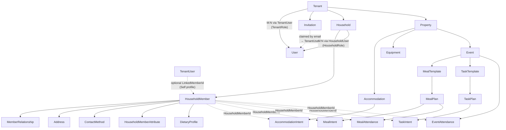
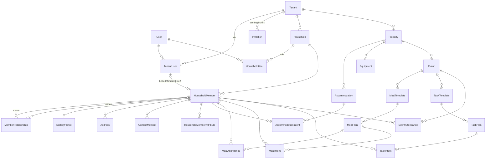

# Gatherstead Architecture

## Technology Stack
This repository uses an Azure-first architecture with a C# .NET API and a Vue 3 / Nuxt 4 web UI. Keep changes aligned with these directions.

## Domain-Driven Design Overview
Gatherstead is organized around bounded contexts that align with the two core goals while sharing a multi-tenant foundation.

### Shared Foundation (Tenancy)
- **User**: Authenticated identity (Entra ID login) with an `ExternalId` for the Entra subject, a nullable indexed `Email` (captured from the verified token claim, used for invitation matching), and an `IsAppAdmin` flag for platform-level administrative access. App Admins bypass all tenant and resource authorization checks and are the only role permitted to create tenants. Internal `User` rows are provisioned just-in-time on first authenticated load via `POST /api/me/bootstrap` (`UserProvisioningService`), which also auto-claims any matching pending invitations.【F:src/Gatherstead.Data/Entities/User.cs】
- **Tenant**: Top-level aggregate for an extended family or organization, providing isolation across families or groups. Tenant creation requires App Admin privilege and specifies the initial Owner user.【F:src/Gatherstead.Data/Entities/Tenant.cs】
- **Invitation**: An app-managed invitation matching an email to a tenant + role (and optional initial household access), with a `Status` of Pending/Accepted/Revoked. Inherits `AuditableEntity` (soft-delete) and carries `TenantId` for global-filter isolation; a filtered unique index enforces at most one live pending invite per `(TenantId, Email)`. Invitations are claimed by email when the invitee first authenticates (or accepted immediately if a matching `User` already exists), so the invite UX is identical whether or not the user pre-exists in the identity provider — no email-delivery infrastructure required. Email is only trusted for claiming when the IdP asserts `email_verified`.【F:src/Gatherstead.Data/Entities/Invitation.cs】

### Family Directory Context
- **Household**: A family grouping. Can evolve as families split or merge.【F:src/Gatherstead.Data/Entities/Household.cs】
- **HouseholdUser**: Join entity that ties a **User** to a **Household** with a `HouseholdRole` (`Manager` or `Member`), mirroring `TenantUser`. Household management authority (edit members, manage household) derives from this record, not from any `HouseholdMember` field. PK `(HouseholdId, UserId)`; carries `TenantId` for global-filter isolation.【F:src/Gatherstead.Data/Entities/HouseholdUser.cs】
- **HouseholdMember**: Person-centric record storing name, birth date, dietary notes/tags, and adult/child markers, with Always Encrypted columns for sensitive data. A member may be linked to a login via `TenantUser.LinkedMemberId` (the FK lives on `TenantUser`, not here), enabling "Self" edit permissions and profile-name access. The link is per-tenant, so a user in multiple tenants has a distinct self-profile in each. Household-level management authority is held by `HouseholdUser`, not by this record.【F:src/Gatherstead.Data/Entities/HouseholdMember.cs】
- **MemberRelationship**: Parent/child/sibling/spouse/guardian links with type and notes, flexible enough to span households for split-family scenarios. Relationship types are informational; edit permissions derive from `HouseholdRole` and the `TenantUser.LinkedMemberId` Self link, not from relationship entries.【F:src/Gatherstead.Data/Entities/MemberRelationship.cs】
- **Address**: Mailing addresses per member. At most one can be designated primary, enforced by a filtered unique index.【F:src/Gatherstead.Data/Entities/Address.cs】
- **ContactMethod**: Email, phone, or other contact entries per member, with a primary-contact designation mirroring the address pattern.【F:src/Gatherstead.Data/Entities/ContactMethod.cs】
- **HouseholdMemberAttribute**: Extensible key-value pairs for custom metadata on a member (e.g., t-shirt size, accessibility needs). Implements `IParentScopedAttribute`; visibility is governed by `TenantMinRole` (caller's tenant role ≤ stored role threshold) and optionally `HouseholdMinRole` (household-role bypass for household-private fields).【F:src/Gatherstead.Data/Entities/MemberAttribute.cs】
- **DietaryProfile**: Comprehensive dietary record per member capturing preferred diet, allergies, restrictions, and notes. A tenant-level list endpoint supports aggregation across attending members for meal planning.【F:src/Gatherstead.Data/Entities/DietaryProfile.cs】

### Custom Attribute Pattern
Nine entities support extensible key-value metadata via a shared `IParentScopedAttribute` interface (`Id`, `TenantId`, `Key`, `Value`, `TenantMinRole`): `TenantAttribute`, `PropertyAttribute`, `AccommodationAttribute`, `EquipmentAttribute`, `EventAttribute`, `MealTemplateAttribute`, `TaskTemplateAttribute`, `HouseholdAttribute`, and `HouseholdMemberAttribute`. Key/value pairs for each entity are unique per `(TenantId, parentId, Key)` and support soft-delete re-activation.

- **Visibility**: Attributes are filtered at read time — a caller only sees attributes whose `TenantMinRole` is ≥ their own tenant role (i.e., the attribute's threshold is at most as restrictive as the caller's role). `HouseholdAttribute` and `HouseholdMemberAttribute` add an optional `HouseholdMinRole` bypass: members whose household role satisfies the threshold see the attribute regardless of their tenant role.
- **API shape**: Attributes are embedded in the parent entity DTO rather than served from separate endpoints. Single-entity GET (`GET /{entityId}`) includes visible attributes; list endpoints return `attributes: []`. Create and update on the parent entity accept an optional `attributes` array (full-replace semantics — omitting the field leaves existing attributes untouched; supplying it replaces all visible attributes while preserving hidden ones).
- **`AttributeSyncHelper`**: A shared static helper (`SyncAsync`) used by all attribute-bearing services. It loads existing rows with `IgnoreQueryFilters()` to surface soft-deleted entries for re-activation, then diffs the incoming write list against persisted rows to add/update/soft-delete in a single `SaveChanges` call, avoiding unique-index violations on `(TenantId, parentId, Key)`.

### Gathering Planning Context

#### Property-level
- **Property**: A physical location that owns accommodations and can host events.【F:src/Gatherstead.Data/Entities/Property.cs】
- **Accommodation**: A place a member may occupy (e.g., guest room, bunk, RV pad, tent site, or offsite placeholder). Exists independently of any event — the room inventory doesn't change per gathering. Captures type, adult/child capacity, and notes.【F:src/Gatherstead.Data/Entities/Accommodation.cs】
- **AccommodationIntent**: Member's request to occupy an accommodation on a given night, with status (`Intent`/`Hold`/`Confirmed`) and a decision field for offline arbitration. Not scoped to an event; nights may fall outside any formal gathering.【F:src/Gatherstead.Data/Entities/AccommodationIntent.cs】
- **Equipment**: Shared equipment or facility owned by a tenant, optionally tied to a specific Property (e.g., kayaks, communal tools). Unique by `(TenantId, PropertyId, Name)`.【F:src/Gatherstead.Data/Entities/Equipment.cs】

#### Event-level
- **Event**: A time-bounded gathering at a property, defining the date window for meal planning, task coordination, and attendance tracking.【F:src/Gatherstead.Data/Entities/Event.cs】
- **EventAttendance**: Per-member, per-day attendance record. Tracks `AttendanceStatus`, arrival/departure windows, and notes; drives meal and task intent generation for the member.【F:src/Gatherstead.Data/Entities/EventAttendance.cs】
- **MealTemplate**: Specifies which meal types (`MealTypeFlags`: Breakfast/Lunch/Dinner) to auto-generate. Optional `StartDate`/`EndDate` fields scope plan generation to a sub-window of the event; when absent, plans span the full event date range.【F:src/Gatherstead.Data/Entities/MealTemplate.cs】
- **MealPlan**: A specific meal on a specific day. Supports exception marking (`IsException`) to suppress auto-generated entries.【F:src/Gatherstead.Data/Entities/MealPlan.cs】
- **MealAttendance**: Member's attendance response for a specific `MealPlan`. Tracks `AttendanceStatus` (Going/Maybe/NotGoing), `BringOwnFood`, and optional `Notes`. Unique per `(MealPlanId, HouseholdMemberId)` — mirrors `EventAttendance` at the individual-meal level.【F:src/Gatherstead.Data/Entities/MealAttendance.cs】
- **MealIntent**: Member's cook-volunteer record for a `MealPlan`. Tracks a single `Volunteered: bool` — parallel in shape to `TaskIntent`.【F:src/Gatherstead.Data/Entities/MealIntent.cs】
- **TaskTemplate**: Template for a recurring task; specifies one or more time slots (`TaskTimeSlotFlags`: Morning/Midday/Evening/Anytime) and drives automatic `TaskPlan` generation. Optional `StartDate`/`EndDate` fields scope plan generation to a sub-window of the event, enabling one-off or partial-event tasks (e.g., setup on day 1 only).【F:src/Gatherstead.Data/Entities/TaskTemplate.cs】
- **TaskPlan**: Dated task instance for a specific day and time slot. Supports exception marking and completion tracking.【F:src/Gatherstead.Data/Entities/TaskPlan.cs】
- **TaskIntent**: Member's volunteer/assignment record for a `TaskPlan`.【F:src/Gatherstead.Data/Entities/TaskIntent.cs】

### Reporting (read-only aggregates)
- **Reports root**: Tenant-scoped reporting lives under a single `ReportsController` (`/tenants/{tenantId}/reports`) so future report types share tenant authorization and routing. The first report type is the **event meal/attendance report** (`/reports/events/{eventId}`), served by `EventReportService` — a read-only aggregate that joins `MealAttendance` through `MealPlan`→`MealTemplate` plus per-day `EventAttendance` to produce day-by-day headcounts, per-meal going/maybe/notGoing/bring-own-food counts, and an aggregated dietary tally (member `DietaryTags` + `DietaryProfile`). Gated at Member+ via `AuthorizeGlobalSensitiveReadAsync` since aggregated dietary needs are allergy-safety information members executing meal prep need to see.

## Entity Hierarchy

The verified ownership hierarchy, derived from FK relationships in the EF Core entities. Solid arrows represent FK ownership (parent → child); dashed arrows represent cross-context references. Attribute child entities are omitted from the diagram for clarity — see the Custom Attribute Pattern section above for the full list.

### Ownership flowchart

### ER diagram (FK cardinality)

## Technology Conventions

### Dependency updates
- Dependency bumps follow the tiered stand-off policy in [SECURITY-DEPS.md](SECURITY-DEPS.md). Dependabot opens weekly grouped PRs for nuget, npm, and github-actions; security-update PRs arrive out-of-band and are triaged against the CVE response tiers in that doc.
- CI gates every PR with `audit-nuget` (`dotnet list package --vulnerable`), `audit-pnpm` (`pnpm audit --audit-level=high`), and GitHub's `dependency-review` action. All four .NET projects set `RestorePackagesWithLockFile=true` and CI runs `dotnet restore --locked-mode` plus `pnpm install --frozen-lockfile`, so lockfile integrity is enforced on every build.

### Infrastructure
- Treat Azure as the primary target: prefer Bicep/ARM over ad-hoc CLI scripting for IaC, and design for App Service/Functions with Managed Identity and Key Vault integration for secrets.
- Plan observability from the start: include App Insights/Log Analytics hooks, structured logs, and dashboards/alerts for auth failures, data-access anomalies, and PII access patterns.
- Default to private networking (VNet integration, private endpoints) for data stores; avoid exposing databases or storage publicly.
- Assume multiple environments (dev/test/prod). Keep configuration in App Configuration/Key Vault and avoid environment-specific code.
- For storage and databases, enforce tenant scoping and indexing that match the domain guidance in [DESIGN_PRINCIPLES.md](DESIGN_PRINCIPLES.md).
- The current SQL implementation targets SQL Server; prefer SQL Server-friendly defaults and tooling when wiring up the data layer.

### Backend
- Use ASP.NET Core dependency injection, nullable reference types, and async APIs. Prefer minimal APIs or controllers consistent with existing style, and keep DTOs separate from EF entities.
- Favor Entity Framework Core migrations for schema changes; keep migrations deterministic and seed data idempotent.
- Validate inputs (model validation attributes/FluentValidation), enforce authorization at three tiers, and log audit events for sensitive operations. Platform-level App Admin authorization uses `RequireAppAdminAttribute` and `IAppAdminContext`. Tenant-level authorization uses `RequireTenantAccessAttribute` (which App Admins bypass). Resource-level authorization (Self, Household Admin) is enforced at the service layer via `IMemberAuthorizationService` (which also short-circuits for App Admins). The **Self** check is tenant-scoped: `TenantUser.LinkedMemberId` identifies a user's person-record within a given tenant, so users who belong to multiple tenants each have an independent self-profile per tenant.
- **Guard composition**: Service methods use `ServiceGuards` (a static helper class) for composable async guards. Each guard mutates the shared `BaseEntityResponse<T>` on failure and returns `false`/`null` to short-circuit the method. Available guards: `RequireRequest`, `LoadOrNotFoundAsync`, `AuthorizeTenantManageAsync` (Owner/Manager), `AuthorizeEventManageAsync` (Coordinator+), `AuthorizeMemberEditAsync`, `AuthorizeIntentAssignAsync`, `AuthorizeHouseholdManageAsync`, `AuthorizeSensitiveReadAsync` (household-scoped sensitive read — returns 403 for Guest users without a `HouseholdUser` entry for that household), `AuthorizeGlobalSensitiveReadAsync` (tenant-wide sensitive read — requires Member+ or App Admin), `RequireNonEscalatingRole`, `RequireMemberExistsAsync`. Validation ordering is: tenant context → request null-check → authorization → field normalization → existence checks → entity load.
- **API endpoint design**: List/read endpoints should support batch filtering via query parameters (e.g., `?ids=aaa,bbb`) to reduce client round-trips. Keep create, update, and delete endpoints singular; introduce workflow-specific batch write endpoints only when concrete use cases demand them (e.g., bulk event setup).
- **Composable global query filters**: `GathersteadDbContext` applies a single global query filter per entity that combines soft-delete exclusion (`IsDeleted`) and tenant isolation (`TenantId`). The soft-delete clause is conditionally toggled via a `_includeDeleted` field on the DbContext instance, which EF Core re-evaluates per query. Tenant isolation is always enforced and cannot be bypassed. This avoids the need to call `IgnoreQueryFilters()` (which removes all filters) and manually reconstruct tenant filtering.
- **Querying deleted entities**: List/read endpoints accept an optional `?includeDeleted=true` query parameter. This is RBAC-gated to `TenantRole.Manager` or higher in `RequireTenantAccessAttribute`; for lower-role users, the flag is silently ignored. The authorization decision flows via `HttpContext.Items` to `IIncludeDeletedContext`, which the DbContext reads at construction time—ensuring the raw query parameter alone cannot bypass RBAC.
- **Identity provider**: The `ExternalIdentity` configuration section supports both Microsoft Entra External ID (`ciamlogin.com`) and Azure AD B2C (`b2clogin.com`). Both use standard OIDC/JWT; the authority URL pattern differs (Entra External ID omits the policy segment) and `SignUpSignInPolicyId` is only required for B2C.
- **JIT provisioning & invitation claiming**: `POST /api/me/bootstrap` (`UserProvisioningService`, authenticated but not tenant-scoped) upserts the caller's internal `User` from the `sub` claim, refreshes `Email`, and auto-claims pending `Invitation`s matching the **verified** email. Email is trusted only when the IdP asserts `email_verified == true`; the spoofable `preferred_username` is never used for matching (a user must not be able to claim another address's invitation). `HttpContextCurrentUserContext.CacheKey` is `public` so the service can pre-seed a brand-new user's id into `HttpContext.Items`, letting the auditing interceptor stamp the self-created row. `MembershipGrant.GrantAsync` is the shared, idempotent helper that both the immediate-accept (existing user) and bootstrap-claim paths use to add `TenantUser`/`HouseholdUser` rows without downgrading existing membership. The Nuxt `tenant.global.ts` middleware invokes bootstrap once before resolving tenants so an invited user's membership exists on first load.

### Frontend
- Use Nuxt 4 conventions (pages, server routes, composables) with the Vue 3 composition API and TypeScript. Keep shared state in composables or Pinia when appropriate.
- Production uses **hybrid rendering** via Nuxt `routeRules`: public/marketing pages are server-rendered for SEO, while authenticated dashboard pages are client-only SPA for faster navigation.
- **Localization**: All UI text must go through `@nuxtjs/i18n` (`$t()` / `useI18n()`). Never hardcode user-visible strings. See [LOCALIZATION.md](agents/plans/LOCALIZATION.md) for the full i18n strategy, locale file conventions, and API error translation approach.
- **Demo site**: A zero-friction demo deployment uses the same codebase with a `demoMode` runtime config flag, swapping real API calls for browser localStorage persistence. See [DEMO_SITE.md](agents/plans/DEMO_SITE.md) for the service layer abstraction, entity limits, seed data, infrastructure, and CI/CD details.
- Prefer **Nuxt UI** components (`UButton`, `UInput`, `UCard`, etc.) over native HTML elements wherever feasible to maintain design consistency. Fall back to native elements only when Nuxt UI has no suitable equivalent.
- Follow accessibility best practices and align UI copy with the family-planning domain.
- Manage secrets via runtime config/environment variables, not hardcoded constants. Respect multi-tenant boundaries in any client-side routing or data fetching.
